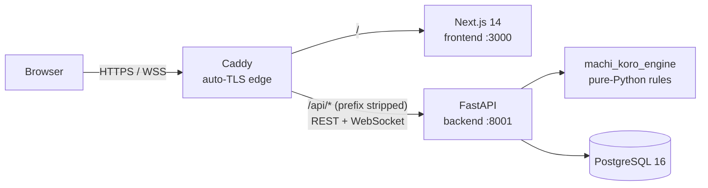

[README_1.md](https://github.com/user-attachments/files/32275906/README_1.md)
# Machi Koro Online

[](https://github.com/MinaA-ctrl/Machi-Koro_web/actions/workflows/engine-tests.yml)
[](https://github.com/MinaA-ctrl/Machi-Koro_web/actions/workflows/backend-tests.yml)

A browser version of the **Machi Koro** city-building dice game for 2–5 players.
You can play as a guest, send friends a table code, and watch every roll, purchase
and card effect update live over WebSockets. The UI is in English and Russian.

**Play it:** **https://machi-koro.pima.kz**

---

## Contents

- [Features](#features)
- [Game modes](#game-modes)
- [Architecture](#architecture)
- [Tech stack](#tech-stack)
- [Repository layout](#repository-layout)
- [Quick start (Docker)](#quick-start-docker)
- [Local development](#local-development)
- [Configuration](#configuration)
- [Testing & CI](#testing--ci)
- [Deployment](#deployment)
- [API overview](#api-overview)
- [Roadmap](#roadmap)
- [Documentation](#documentation)
- [Credits & license](#credits--license)

---

## Features

- **Low-friction multiplayer.** Play as a guest in one click, or register an
  account. Create a table, share its code, and join by code or from the public
  lobby. Tables can have a password.
- **Server-authoritative game.** The backend engine enforces every rule. The
  client only renders snapshots and sends intents, so it can't cheat or fall out
  of sync.
- **Restart-safe.** Game state is written to Postgres after every action. If the
  backend restarts mid-game, players reconnect and continue.
- **All interactive cards.** The game prompts the player for Harbour and
  Sharp choices: TV Station, Business Center, Cleaning Company, Demolition,
  Moving Company, Tech Startup, reroll, tuna boat and others. A prompt that times
  out resolves with a default choice.
- **Bilingual EN / RU.** The UI, card names, card effects and the game log are
  all translated. The log is built from keyed engine events, not from English
  strings.
- **Table life.** Emoji reaction bubbles, green and red coin toasts, a game
  history grouped by turn, a view of any opponent's city, synthesized sound
  effects with a mute toggle, and rematches.
- **Stats.** Points per game, match history and account totals for registered
  players.
- **Accessibility.** Honors `prefers-reduced-motion`, shows visible focus rings,
  traps focus in modals, uses AA-contrast card bands, and announces toasts
  through `aria-live`.
- **Responsive.** Works on desktop and tablet layouts and is usable on a phone.

## Game modes

The host picks three settings when creating a table. Each can be set on its own:

| Setting | Values | Notes |
|---|---|---|
| **Base game** | `Basic` · `Harbour` | Harbour adds the Harbour expansion cards and landmarks. |
| **Sharp add-on** | on / off | Adds the *Millionaire's Row* cards (all 13) on top of either base game. |
| **Variable Supply** | on / off | The "10-card market": only 10 establishment types are face up at a time, refilled from a shuffled deck. Defaults to on with Sharp. |

The engine builds a `GameConfig` from these settings with
`config_for(base, sharp, variable_supply)`. Supporting another version means
adding a config. The engine logic stays the same.

## Architecture



| Service | Role |
|---|---|
| `caddy` | Edge reverse proxy with automatic Let's Encrypt certificates. Sends `/api/*` to the backend with the `/api` prefix removed, and everything else to the frontend. Proxies WebSocket upgrades as-is. |
| `frontend` | Next.js 14 standalone server. It calls the backend on the same origin through `/api`, so it needs no CORS and exposes no public port. |
| `backend` | FastAPI app (`app.main`) serving REST, both WebSockets, JWT auth, entitlements and a background task that removes stale tables. It runs Alembic migrations on startup. |
| `postgres` | Stores tables, players, game state (JSONB), accounts, scores, entitlements and wallets. |

**Game engine.** `websocket-server/machi_koro_engine` is headless. It imports
only the Python standard library, so every part of the system uses the same
rules. All randomness goes through one seedable RNG, which makes games
reproducible in tests.

**Real-time flow.** The client sends an action on the game socket. The backend
takes a lock for that table, runs `handle_action`, saves the new state to
Postgres, and only then broadcasts `state_update` to every seat. Each seat gets
its own HMAC-signed WebSocket token, created by an authenticated REST call. A
token for one seat is rejected on any other seat (close code `4401`).

## Tech stack

| Layer | Technologies |
|---|---|
| Frontend | Next.js 14 (App Router), React 18, TypeScript (strict), Tailwind CSS, Zustand, TanStack Query, next-intl, Vitest, Playwright |
| Backend | Python 3.12, FastAPI, Uvicorn, SQLAlchemy 2.0 (async) + asyncpg, Alembic, PyJWT, argon2 (passlib) |
| Engine | Pure Python (stdlib only), pytest |
| Data | PostgreSQL 16 |
| Infra | Docker Compose, Caddy 2, GitHub Actions; Hetzner VPS, Cloudflare DNS / Pages |

## Repository layout

```
Machi-Koro_web/
├── frontend/                  # Next.js 14 + TypeScript client (see frontend/README.md)
│   ├── src/app/[locale]/      #   routes: lobby, browse, table/[code], game/[code], rules, market, landing
│   ├── src/components/        #   board/, lobby/, auth/, landing/, ui/ (design-system atoms)
│   ├── src/lib/               #   REST client, WebSocket client, game actions, i18n helpers, sound
│   ├── src/store/             #   Zustand game store (mirror of server snapshots)
│   ├── messages/{en,ru}.json  #   translations
│   └── Dockerfile             #   bun build → node:20-alpine standalone runtime
├── websocket-server/          # Python backend
│   ├── app/                   #   FastAPI app: routers/ (auth, tables), ws.py, auth, entitlements, reaper
│   ├── machi_koro_engine/     #   the rules engine + its test suite
│   ├── persistence/           #   SQLAlchemy models, repository, Alembic migrations
│   ├── Dockerfile.backend
│   └── backend-entrypoint.sh  #   alembic upgrade head → uvicorn
├── docker-compose.yml         # production stack: caddy + frontend + backend + postgres
├── Caddyfile                  # edge routing
├── .env.example               # all environment variables, documented
├── .github/workflows/         # CI: engine-tests, backend-tests, php-ci
├── Developer stages/          # stage plans, handoffs, QA reports, runbooks
├── MachiKoro_PRD.md           # product requirements & roadmap
│
│   # Legacy (kept for reference / rollback, not in the serving path)
├── docker-compose.legacy.yml  # old WordPress + MySQL + nginx stack
├── wp-plugin/                 # old WordPress page-host plugin
├── nginx/                     # old nginx config (replaced by Caddy)
└── layout-demo.html           # early standalone UI prototype
```

## Quick start (Docker)

You need Docker with the Compose plugin.

```bash
git clone https://github.com/MinaA-ctrl/Machi-Koro_web.git
cd Machi-Koro_web
cp .env.example .env
```

Edit `.env` for a local run over HTTP:

```dotenv
SITE_DOMAIN=:80                         # plain HTTP, no certificate
POSTGRES_PASSWORD=change-me-postgres
MK_JWT_SECRET=<output of: openssl rand -hex 32>
MK_WS_SECRET=<output of: openssl rand -hex 32>
```

> The backend runs with `MK_ENV=prod` and **will not start** if either secret is
> missing or left at an insecure default.

```bash
docker compose up -d --build
curl http://localhost/api/health        # → {"status":"ok"}
```

Open **http://localhost** in two browser windows. Create a table in one and join
it with the code from the other.

> **Rebuild after code changes.** `backend` and `frontend` are built images, so
> `docker compose up` alone won't pick up your changes. Run
> `docker compose build backend frontend && docker compose up -d`.

## Local development

### Engine only (no database needed)

```bash
cd websocket-server
pip install -r requirements-dev.txt
python -m pytest                        # engine test suite (~200 tests)
```

### Backend

The backend needs a running PostgreSQL. Connection settings come from `DB_*`
variables or a full `DATABASE_URL`.

```bash
cd websocket-server
python -m venv .venv && source .venv/bin/activate
pip install -r requirements-backend.txt

export DB_HOST=localhost DB_PORT=5432 DB_NAME=machikoro DB_USER=machikoro DB_PASSWORD=machikoro
export MK_JWT_SECRET=dev-jwt-secret MK_WS_SECRET=dev-ws-secret

(cd persistence && alembic upgrade head)          # apply migrations
uvicorn app.main:app --reload --port 8001         # interactive docs at http://localhost:8001/docs
```

Without `MK_ENV=prod` the startup secret check and rate limiting are both off,
which suits local work and tests.

### Frontend

The frontend uses [bun](https://bun.sh), and the repository ships a `bun.lock`.

```bash
cd frontend
bun install
cp .env.example .env.local
bun run dev                             # http://localhost:3000 → redirects to /en
```

| Script | Purpose |
|---|---|
| `bun run dev` / `build` / `start` | Next.js dev server / production build / serve the build |
| `bun run typecheck` | `tsc --noEmit` |
| `bun run lint` | ESLint (`next lint`) |
| `bun run test` | Unit tests (Vitest) |
| `bun run test:e2e` | End-to-end tests (Playwright) |

The backend doesn't enable CORS, so the browser must reach it on the same origin.
In dev mode, `next.config.mjs` rewrites `/api/*` to a local gateway (set in
`rewrites()`, currently `localhost:8082`, left over from the old nginx setup). To
point `bun run dev` at the Docker stack from the quick start, change that
destination to Caddy (`http://localhost:80`) and set
`NEXT_PUBLIC_WS_BASE=ws://localhost/api` in `.env.local`.

Useful dev-only routes: `/en/styleguide` shows the design-system atoms, and
`/en/board-preview` renders the game board from fixture data without a backend.

## Configuration

All variables are documented in [`.env.example`](.env.example).

| Variable | Required | Default | Purpose |
|---|---|---|---|
| `SITE_DOMAIN` | yes | `machi-koro.pima.kz` | Domain Caddy gets a certificate for. Use `:80` for local HTTP. |
| `POSTGRES_DB` / `POSTGRES_USER` / `POSTGRES_PASSWORD` | yes | `machikoro` | Postgres credentials. The backend receives them as `DB_*`. |
| `MK_JWT_SECRET` | **yes (prod)** | — | HS256 secret that signs JWT access and refresh tokens. |
| `MK_WS_SECRET` | **yes (prod)** | — | HMAC secret that signs per-seat WebSocket tokens. |
| `MK_ENV` | — | `prod` in compose | Enforces real secrets and turns on rate limiting. |
| `MK_RATE_LIMIT` | — | off outside prod | Set to `on` to force rate limiting in dev. |
| `MK_STALE_WAITING_MIN` | — | `30` | Minutes before an idle waiting table is hidden and deleted. |
| `MK_ABANDONED_PLAYING_MIN` | — | `120` | Minutes without a save before a running game is marked `abandoned`. |
| `MK_REAPER_INTERVAL_SEC` | — | `300` | How often the background cleanup runs. |
| `NEXT_PUBLIC_API_BASE` | — | `/api` | Frontend REST base, baked in at build time. |
| `NEXT_PUBLIC_WS_BASE` | — | `/api` | Frontend WebSocket base. A relative value resolves to `ws(s)://<page-host>/api`. |

The `MYSQL_*` variables are used only by `docker-compose.legacy.yml`.

## Testing & CI

| Suite | Location | How to run | Needs |
|---|---|---|---|
| Engine | `websocket-server/machi_koro_engine/tests` | `cd websocket-server && python -m pytest` | nothing |
| Persistence | `websocket-server/persistence/tests` | `cd websocket-server/persistence && alembic upgrade head && python -m pytest` | Postgres |
| API / WebSocket | `websocket-server/app/tests` | `cd websocket-server/app && python -m pytest` | migrated Postgres |
| Frontend | `frontend/` | `bun run typecheck && bun run lint && bun run test` | — |

GitHub Actions workflows in `.github/workflows/`:

- **engine-tests** runs the engine suite on Python 3.13.
- **backend-tests** starts Postgres 16, applies the Alembic migrations, then runs
  the persistence and API suites on Python 3.12.
- **php-ci** lints the legacy WordPress plugin.

No CI job covers the frontend yet. The next step would be a workflow that runs
`bun install && bun run build && bun run typecheck`.

## Deployment

Production is a single VPS running the Docker Compose stack above. Caddy
handles TLS. A Cloudflare **DNS-only** (grey cloud) A record for
`machi-koro.pima.kz` points at the server, so Caddy can pass the ACME challenge
and serve WebSockets directly.

```bash
# on the server, with .env filled in
docker compose up -d --build
docker compose logs backend | tail      # "applying Alembic migrations…" → "Uvicorn running"
curl -s https://machi-koro.pima.kz/api/health
```

The runbook covers provisioning, DNS, secrets, verification and rollback:
[`Developer stages/stage-3-handoffs/deploy-prod.md`](Developer%20stages/stage-3-handoffs/deploy-prod.md).

The author's business-card site (`pima.kz`) is a separate static page deployed to
Cloudflare Pages and is not part of this stack.

## API overview

REST endpoints, reached through Caddy under `/api`. The backend also serves
interactive OpenAPI docs at `/docs`.

| Method | Path | Description |
|---|---|---|
| `GET` | `/health` | Liveness check |
| `POST` | `/auth/guest` · `/auth/register` · `/auth/login` | Get a `{access_token, refresh_token}` pair |
| `POST` | `/auth/refresh` | Issue a new token pair (the refresh token is rotated) |
| `GET` | `/auth/me` · `/auth/me/stats` · `/auth/me/history` | Profile, totals, and past games |
| `POST` | `/tables` | Create a table and get `{code, seat, token}` |
| `GET` | `/tables` · `/tables/{code}` · `/tables/stats` | Lobby list (`?search=`), table details, online counts |
| `POST` | `/tables/{code}/join` · `/start` · `/kick` · `/rename` | Join, start (host only), kick (host only), rename a seat |

WebSocket channels:

| Path | Purpose |
|---|---|
| `/ws/{code}/lobby/{seat}` | Waiting-room presence: joined, left, kicked, renamed, game started |
| `/ws/{code}/game/{seat}?token=…` | Live game: `state_update`, `game_prompt`, `coin_event`, toasts, reactions |

Access tokens expire after 15 minutes and refresh tokens after 30 days. Login,
registration and guest sign-in are limited to 10 requests per minute per IP, and
table creation to 5 (only when rate limiting is on). The WebSocket event
contract is documented in
[`Developer stages/stage-3-ws-event-contract.md`](Developer%20stages/stage-3-ws-event-contract.md).

## Roadmap

| Stage | Scope | Status |
|---|---|---|
| 0–1 | Stabilize the MVP, extract the engine, add Basic/Harbour/Sharp and Variable Supply | ✅ done |
| 2 | FastAPI + PostgreSQL backend, JWT accounts, entitlements seam | ✅ done |
| 3 | React + TypeScript frontend, EN/RU, responsive, cutover from WordPress | ✅ done, live |
| 4 | Stats: leaderboards, profile page (points and history already shipped) | 🟡 in progress |
| 5 | AI opponent (Easy / Medium / Hard) and a tactics advisor | planned |
| 6 | Native mobile app (React Native / Expo) | planned |
| 7–8 | Cosmetics shop, Koro Coins, freemium (Harbour Pass) | planned (the backend already has an entitlements and wallet layer) |

The full product plan is in [`MachiKoro_PRD.md`](MachiKoro_PRD.md).

## Documentation

- [`frontend/README.md`](frontend/README.md): frontend architecture, design
  tokens, i18n, accessibility
- [`websocket-server/app/README.md`](websocket-server/app/README.md): backend API,
  auth and security model, table lifecycle, entitlements
- [`websocket-server/machi_koro_engine/README.md`](websocket-server/machi_koro_engine/README.md):
  engine public API and the config seam
- [`websocket-server/persistence/README.md`](websocket-server/persistence/README.md):
  database models, repository, migrations
- [`Developer stages/`](Developer%20stages/): stage plans, handoffs, QA reports,
  runbooks ([Stage 3 closeout](Developer%20stages/stage-3-closeout.md))

## Credits & license

Built by **Amina Beiganova** ([@MinaA-ctrl](https://github.com/MinaA-ctrl)).

This is an unofficial fan implementation. *Machi Koro* was designed by Masao
Suganuma and published by Grounding Inc. This project is not affiliated with or
endorsed by the designer or the publishers.

The repository has no open-source license, so all rights are reserved by the
author unless stated otherwise.
